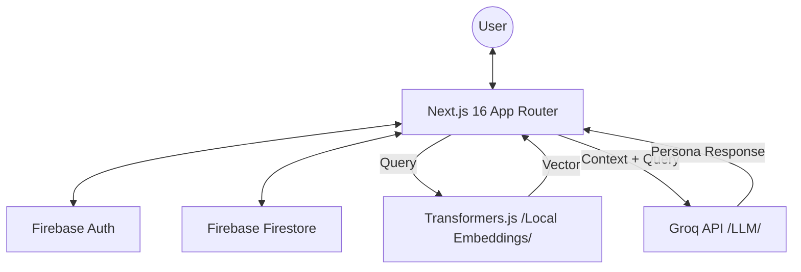

# Architecture Overview

This document describes the high-level architecture of the Kabir Dohas application, focusing on the AI-powered search and response generation logic.

## System Components

## Key Flows

### 1. Vector Search Q&A
1. **User Input**: User enters a question or life situation.
2. **Embedding Generation**: The app uses `Transformers.js` (locally in the browser or API) to convert the text into a vector embedding.
3. **Similarity Search**: The vector is compared against a pre-computed local store of doha embeddings (`dohas_with_embeddings.json`) using cosine similarity.
4. **Context Preparation**: The top matching dohas (text and translations) are extracted.
5. **LLM Invocation**: The query and the matching dohas are sent to **Groq** using a specialized "Kabir Devotee" persona prompt.
6. **Response**: Groq returns a response that explains the dohas in the context of the user's question.

### 2. View Count Tracking
1. When a user views a doha details page, an API call is made to the unified endpoint `/api/doha/[id]`.
2. The server-side code (App Router handler) uses `firebase-admin` to perform an **atomic increment** on the `viewCount` field in the `dohaViews` collection.
3. Document IDs in `dohaViews` are exactly matching the `dohaId` of the doha for direct lookup.

### 3. Favorites
1. Users authenticate via Google.
2. Favorites are stored in a `userFavorites` collection in Firestore, keyed by the user's UID.

## Performance Considerations
- **Cold Boot Optimizer**: The `preload_model.ts` script can be used to warm up the Docker container's model cache.
- **In-Memory Store**: Doha data is loaded into memory at runtime to avoid database overhead for every search query.
- **Atomic Operations**: Always use Firestore's `FieldValue.increment()` for counters to avoid data corruption under load.
